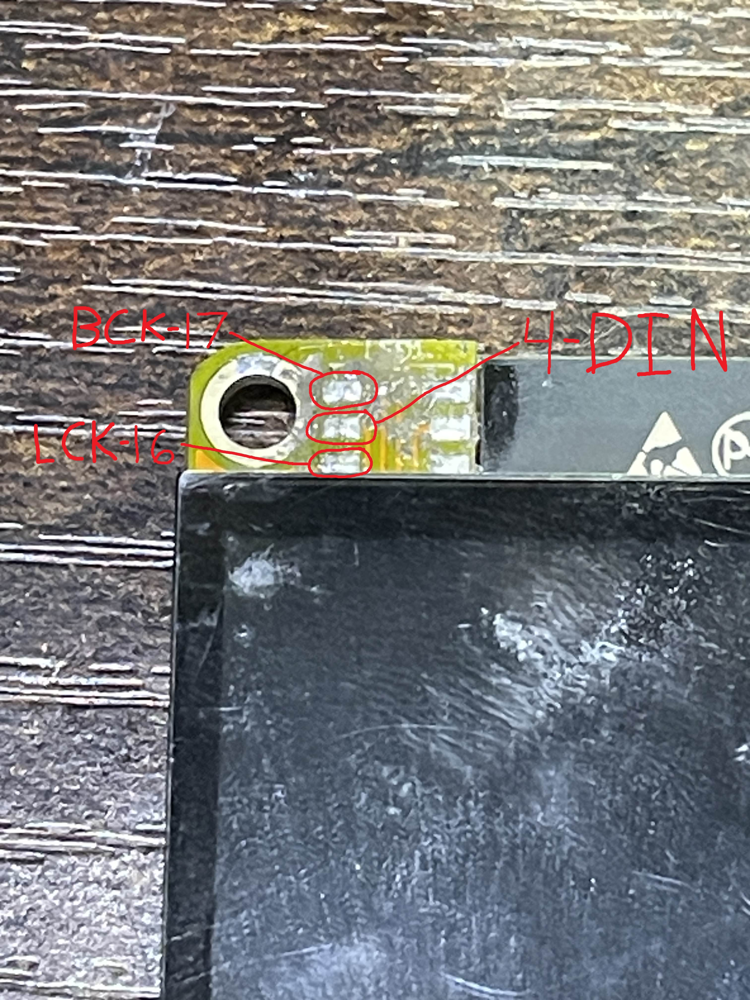
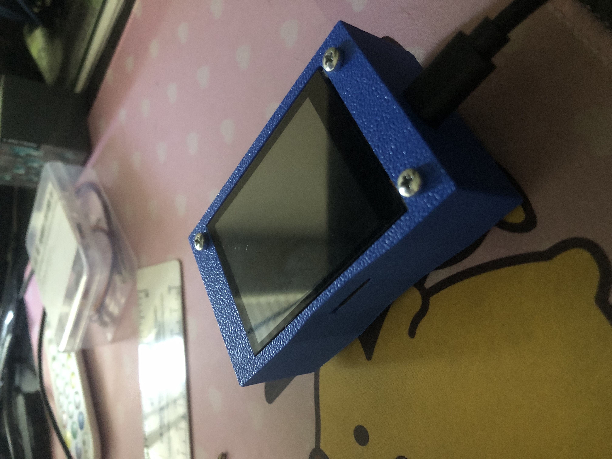
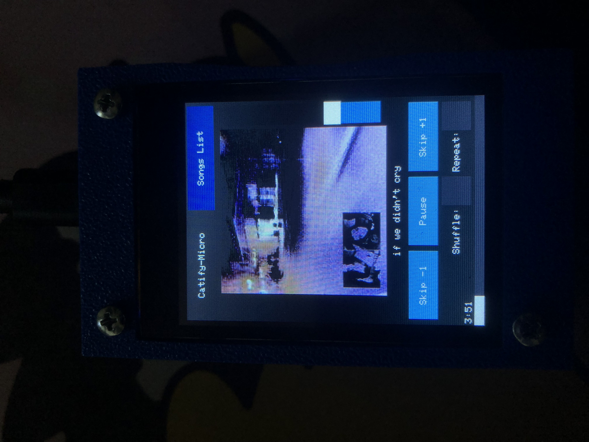
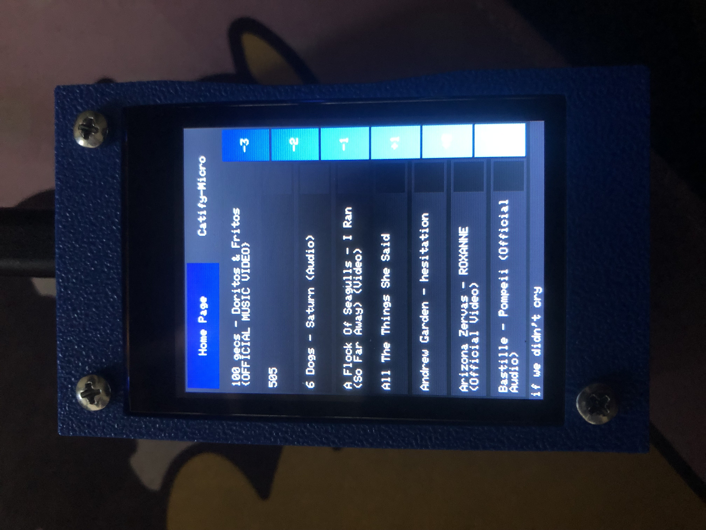

<a id="readme-top"></a>

<div align="center">
  <a href="https://github.com/Cat-Pog-Real/Catify-Micro">
    
  </a>

  <h3 align="center">Catify-Micro</h3>

  <p align="center">
    A compact, physical MP3 player powered by a variant of <a href="https://github.com/Cat-Pog-Real/Catify">Catify</a>.
    <br />
    <br />
    <br />
    <a href="#building">Building</a>
    .
    <a href="#usage">Usage</a>
    ·
    <a href="#images">Images</a>
    ·
    <a href="https://github.com/Cat-Pog-Real/Catify/issues">Report Bug</a>
  </p>
</div>

---

## Requirements

### Hardware:
- [ESP32-2432S024C (aka cydc)](https://www.amazon.com/DIYmalls-ESP32-2432S024C-Capacitive-ESP-WROOM-32-Development/dp/B0CLGD2DG6)
- [PCM5102A DAC](https://www.aliexpress.us/item/3256806852386264.html?spm=a2g0o.order_list.order_list_main.79.587e1802SY02Nj&gatewayAdapt=glo2usa)
- [104060 3000mAh Li-ion Battery](https://www.aliexpress.us/item/3256807952055157.html?spm=a2g0o.order_list.order_list_main.66.587e1802SY02Nj&gatewayAdapt=glo2usa)
- 3 M3 30mm Screws  
- 3 M3 Hex Nuts  
- 3 M3 Lock Nuts  
- 3 Nylon Washers  
- MicroSD card (~16GB recommended)  
- MicroSD card reader

### Software:
- [Catify](https://github.com/Cat-Pog-Real/Catify)
- [Pillow (Python Imaging Library)](https://pypi.org/project/pillow/)

---

## Building It Yourself: <a id="building"></a>

### Electronics:

1. **Remove** the front LED from the ESP32 board.  
2. **Solder** the 3 exposed GPIO pins to the DAC’s `BCK`, `DIN`, and `LCK` pins.  
   <div align="center">
     
   </div>
3. **Connect** both power and ground from the ESP32 to the DAC.  
4. **Install** the [Catify](https://github.com/Cat-Pog-Real/Catify) software.  
5. **Install** Pillow via pip:  
   ```bash
   pip install pillow
   ```
6. **Flash** the device with the firmware.

### Assembly:

1. Make the **cover screw holes slightly larger than 3mm** so the screws can slide in freely.  
2. Insert the **3 M3 30mm screws** through the front of the case.  
3. Place the **ESP32 board (with DAC soldered)** inside the case.  
4. Install the **button** into the designated hole.  
5. Add **nylon washers** on the screws behind the PCB (you may need to trim them to fit).  
6. Add **hex nuts** to hold the PCB in place snugly.  
7. **Plug in the battery** to the ESP32 board.  
8. Place the **battery inside the bottom/back cover** compartment.  
9. Attach the **back cover**.  
10. Finally, secure it with **M3 lock nuts** on the screws sticking out the back.

---

## Using the Device <a id="usage"></a>

### Uploading Songs:

1. Download a song using [Catify](https://github.com/Cat-Pog-Real/Catify).
2. Copy the `songs` folder (located in `user_data`) into the same directory as the `importer.py` script and run it.
3. Transfer both the `songs` and `song_cache` folders onto your MicroSD card using the reader.

### Playing & Selecting Songs:

- On the **Song List** page:
  - Tap the box next to a song’s name to select it.
  - Use the **blue page buttons** on the right to navigate between song pages.
- For **detailed playback controls**, switch to the **Home Page**.

---

## Images <a id="images"></a>

<div align="center">
  
  <br /><em>Device Powered Off</em>
</div>

---

<div align="center">
  
  <br /><em>Home Page — Playback Controls</em>
</div>

---

<div align="center">
  
  <br /><em>Song List Page — Song Selection</em>
</div>

---

## Links

- 🐱 [Catify Repository](https://github.com/Cat-Pog-Real/Catify)
- Author: [Jackson Foley](https://github.com/Cat-Pog-Real)